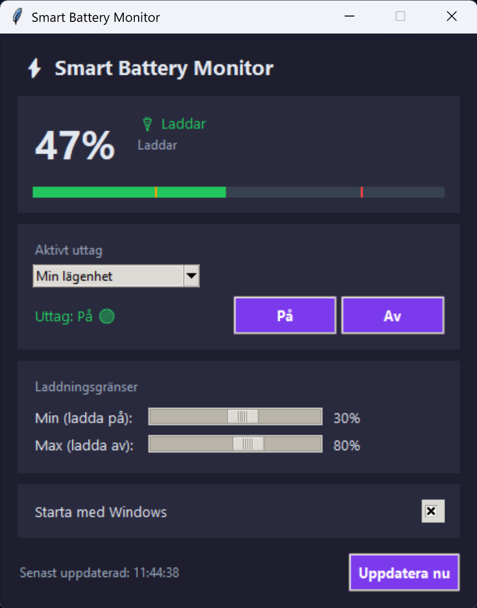

# ⚡ Smart Battery Monitor

A lightweight Windows app that automatically controls a **Tuya smart plug** based on your laptop's battery level — keeping your battery healthy by avoiding full charges and deep discharges.



---

## ✨ Features

- 🔋 **Automatic plug control** — turns the plug on/off based on your battery level
- 🌍 **Multi-language** — Swedish, English, German, French, Spanish, Norwegian, Danish, Finnish
- 🔌 **Multiple plugs** — switch between several smart plugs easily
- 🪟 **System tray** — runs quietly in the background, minimizes to tray
- 🚀 **Start with Windows** — optional autostart toggle built in
- ⚙️ **Configurable limits** — set your own min/max battery thresholds
- 🛠️ **App Generator** — build your own personalized version via the web tool

---

## 🖥️ Screenshots

| Main window | System tray |
|---|---|
|  |  |

---

## 🚀 Quick Start

### 1. Install Python

Download from [python.org](https://www.python.org/downloads/) — make sure to check **"Add Python to PATH"** during installation.

### 2. Install dependencies

```bash
pip install tinytuya psutil pillow pystray
```

### 3. Set up a Tuya developer account

1. Go to [iot.tuya.com](https://iot.tuya.com) and create a free account
2. Click **Cloud → Development → Create Cloud Project**
3. Fill in:
   - **Industry:** Smart Home
   - **Development Method:** Smart Home
   - **Data Center:** Central Europe *(or your region)*
4. Authorize the default API services and click **Create**
5. Go to **Devices → Link Tuya App Account → Add App Account**
6. Scan the QR code with your **Smart Life app** on your phone
7. Copy your **Client ID** and **Client Secret** from the project Overview page
8. Copy the **Device ID** for your smart plug from the Devices tab

> ⚠️ **Important:** Make sure the Data Center in your Tuya project matches the region your Smart Life account is registered in. You can check your region in the Smart Life app under Me → Settings → Account and Security.

### 4. Generate your app

Use the **[App Generator](https://YOUR_USERNAME.github.io/smart-battery-monitor/)** to fill in your credentials and download a ready-to-run `battery_monitor.py`.

Or manually edit the `DEFAULT_CONFIG` section at the top of `battery_monitor.py`:

```python
DEFAULT_CONFIG = {
    "api_key":    "YOUR_CLIENT_ID",
    "api_secret": "YOUR_CLIENT_SECRET",
    "api_region": "eu",
    "devices": [
        {"id": "YOUR_DEVICE_ID", "name": "My Plug"},
    ],
    "min_level": 20,   # Turn plug ON when battery drops to this %
    "max_level": 80,   # Turn plug OFF when battery reaches this %
}
```

### 5. Run the app

Double-click `Starta_Battery_Monitor.bat`, or run:

```bash
pythonw battery_monitor.py
```

---

## 🔧 How it works

The app polls your battery every **30 seconds**. When the battery drops below the minimum threshold and the plug is off, it turns the plug on to start charging. When the battery reaches the maximum threshold and the plug is on, it turns it off to stop charging.

```
Battery < min% and not charging  →  Turn plug ON  🟢
Battery ≥ max% and charging      →  Turn plug OFF 🔴
```

This keeps your battery in the optimal charge range, which helps extend its lifespan over time.

---

## 🌍 Supported Languages

| Code | Language |
|------|----------|
| `sv` | Svenska |
| `en` | English |
| `de` | Deutsch |
| `fr` | Français |
| `es` | Español |
| `no` | Norsk |
| `da` | Dansk |
| `fi` | Suomi |

---

## 📦 Dependencies

| Package | Purpose |
|---------|---------|
| [tinytuya](https://github.com/jasonacox/tinytuya) | Tuya Cloud API communication |
| [psutil](https://github.com/giampaolo/psutil) | Reading battery status |
| [Pillow](https://python-pillow.org/) | Generating tray icon |
| [pystray](https://github.com/moses-palmer/pystray) | System tray support |

---

## ❓ Troubleshooting

**The app launches but the plug doesn't respond**
- Make sure your Tuya IoT Core subscription is active at iot.tuya.com → Cloud → My Services
- Check that the Data Center in your project matches your Smart Life account region
- Try clicking "Refresh now" in the app to force a poll

**"Data center is suspended" error**
- Go to iot.tuya.com → Cloud → My Services → IoT Core → Extend/Renew

**The tray icon doesn't appear**
- Make sure `pystray` and `pillow` are installed: `pip install pystray pillow`

**App doesn't start with Windows**
- Run the app once manually, then check the "Start with Windows" checkbox inside the app

---

## 📄 License

MIT License — free to use, modify and distribute.

---

## 🙏 Credits

Built with [tinytuya](https://github.com/jasonacox/tinytuya) by Jason Cox.
